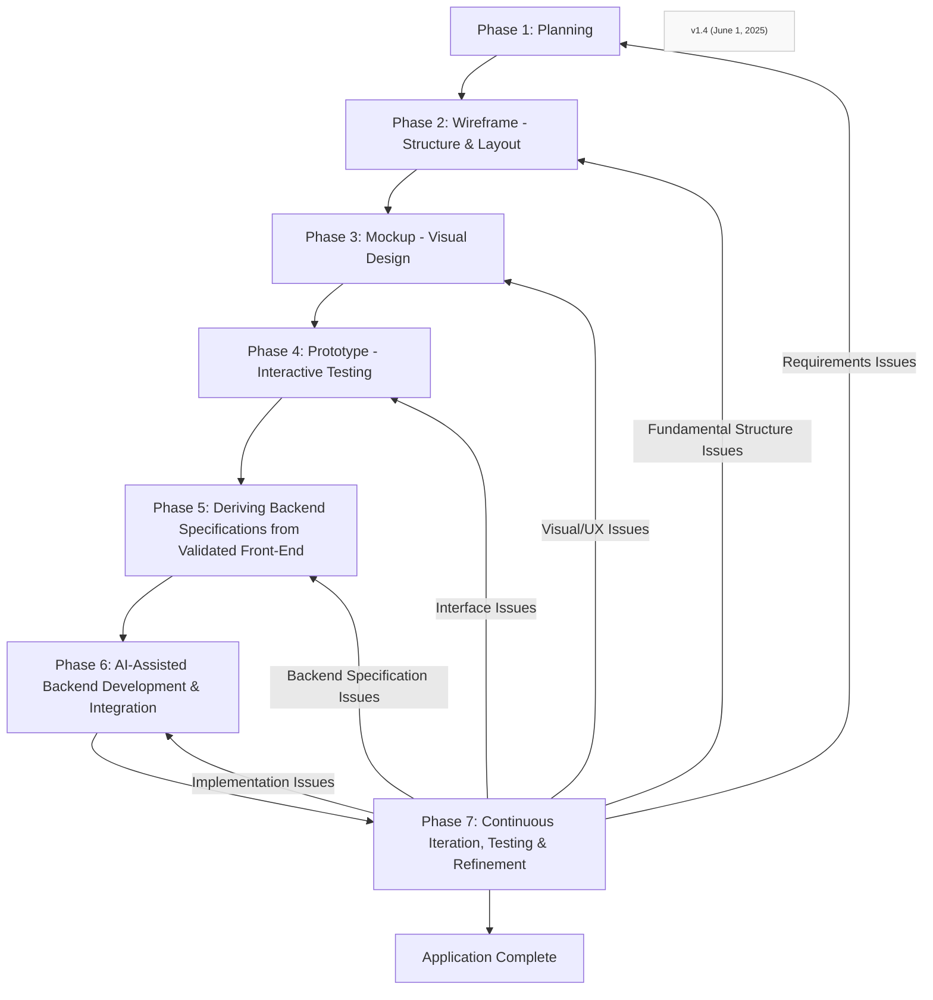

```mermaid
graph TD
Phase1["Phase 1: Planning"] --> Phase2["Phase 2: Wireframe - Structure & Layout"]
    Phase2 --> Phase3["Phase 3: Mockup - Visual Design"]
    Phase3 --> Phase4["Phase 4: Prototype - Interactive Testing"]
    Phase4 --> Phase5["Phase 5: Deriving Backend Specifications from Validated Front-End"]
    Phase5 --> Phase6["Phase 6: AI-Assisted Backend Development & Integration"]
    Phase6 --> Phase7["Phase 7: Continuous Iteration, Testing & Refinement"]
    Phase7 --> Phase8["Application Complete"]
    
    Phase7 -->|Implementation Issues| Phase6
    Phase7 -->|Interface Issues| Phase4
    Phase7 -->|Backend Specification Issues| Phase5
    Phase7 -->|Visual/UX Issues| Phase3
    Phase7 -->|Fundamental Structure Issues| Phase2
    Phase7 -->|Requirements Issues| Phase1
    
    Version["v1.4 (June 1, 2025)"]
    
    classDef version fill:#f9f9f9,stroke:#ccc,font-size:10px
    class Version version
```
