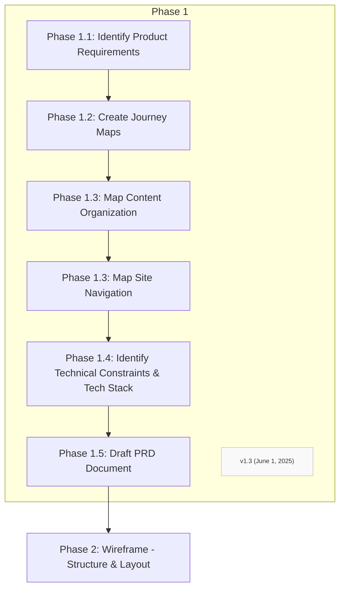

Key Nuances from Full Instructions:
Step 1.1: Elicit and Clarify UI/UX Requirements & User Flows
Critical Requirements Gathering:

Target Users: Identify and understand the primary user personas
Key User Goals: Define what users are trying to accomplish
Primary Tasks: Map out the essential actions users need to perform
Essential Features: Determine must-have functionality vs. nice-to-have
Desired User Journeys: Chart complete end-to-end user experiences

AI Agent Guidelines:

Ask clarifying questions to ensure completeness
Suggest common patterns where applicable
Focus on user-centricity as the primary driver
Document all requirements systematically

Collaborative Definition Process:

Work with human user to gather detailed requirements
Assist by suggesting common UI/UX patterns
Ask targeted questions to ensure completeness
Ensure all user flows are clearly documented

Validation Checkpoint:

Present complete requirements for human review
Iterate based on feedback until approved
Document all requested changes
Ensure no ambiguities remain before proceeding

Output: Comprehensive requirements document that serves as foundation for all subsequent phases.
