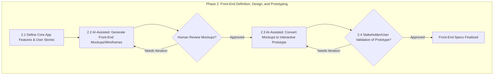

```mermaid
graph TD
    
    
    subgraph Phase1 ["Phase 2: Front-End Definition, Design, and Prototyping"]
        B1["2.1 Define Core App Features & User Stories"]        
        B1 --> B2["2.2 AI-Assisted: Generate Front-End Mockups/Wireframes"]
        B2 --> B2_Val{"Human Review Mockups?"}
        B2_Val -->|Needs Iteration| B2
        B2_Val -->|Approved| B3["2.3 AI-Assisted: Convert Mockups to Interactive Prototype"]
        B3 --> B4_Val{"2.4 Stakeholder/User Validation of Prototype?"}
        B4_Val -->|Needs Iteration| B3
        B4_Val -->|Approved| C_Spec["Front-End Specs Finalized"]
    end
```
