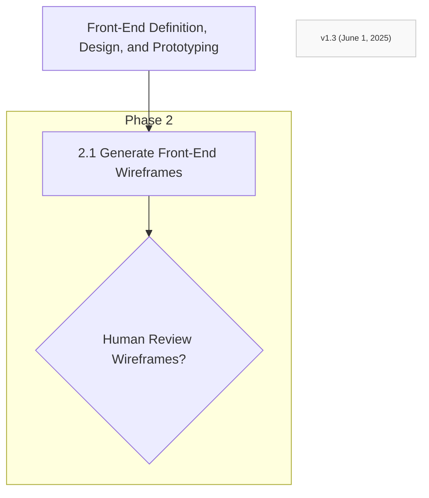

Step 2.1: Generate Front-End Mockups/Wireframes (AI-assisted)
AI-Assisted Generation Process:

Propose layouts and common UI components (buttons, forms, tables, navigation menus)
Focus on functionality-appropriate design suggestions
Generate initial wireframes based on user flows
Present visual suggestions for each identified view/screen

Quality Standards:

Each mockup must correspond directly to user flows
UI components must be suitable for described functionality
Layout must support all identified primary tasks

Step 2.2: Human Review & Iteration Loop
Validation Requirements:

Present mockups for thorough human review
Iterate based on feedback until structure is approved
Document all changes and rationale
Ensure completeness before proceeding

Step 2.3: Develop Interactive Front-End Prototypes
Technical Implementation:

Technology Options: Static HTML, CSS, JavaScript OR specified UI library/framework components
Interactivity Focus: Button clicks leading to other views, form field interactions, navigation flows
Data Handling: Use placeholder/mock data to simulate dynamic content
Responsive Design: Ensure prototype works across different screen sizes
Design Guidelines: Adhere to any specified design standards

AI Agent Responsibilities:

Generate working prototypes, not just static images
Focus on accurate representation of UI elements and layout
Implement basic user interactions that mirror final application

Step 2.4: Stakeholder/User Validation Loop
Comprehensive Validation Process:

Usability Testing: Ensure intuitive user interactions
Feature Completeness: Verify all required functionality is represented
User Flow Accuracy: Confirm flows match requirements
Design Quality: Overall aesthetic and functional design review

Critical Validation Loop:

Document ALL requested changes
Iterate between Step 2.3 and 2.4 until FULLY approved
No proceeding without explicit approval
Validated prototype becomes the PRIMARY SPECIFICATION

AI Agent Guidelines for This Phase:

Proactive Validation: Always ask for human review before proceeding
Iterative Refinement: Expect multiple rounds of feedback and iteration
Documentation: Keep detailed records of all changes and decisions
Quality Focus: Ensure prototypes accurately represent final intended functionality

Critical Output: The validated front-end prototype becomes the authoritative source of truth for all backend development phases.
