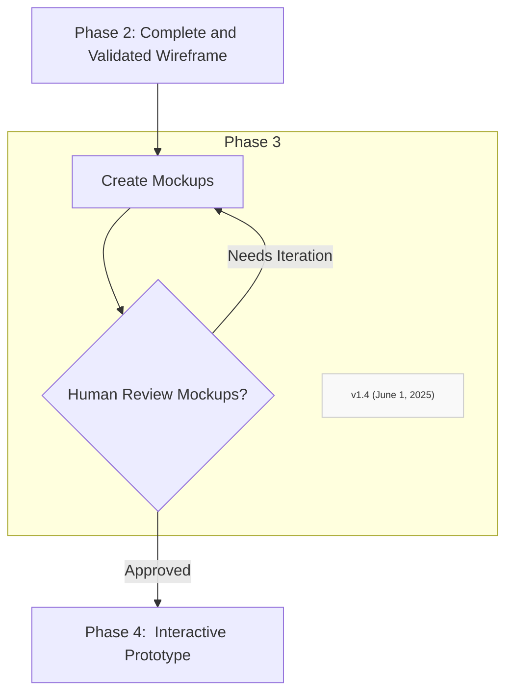

```mermaid
graph TD
    
B1["Phase 2: Complete and Validated Wireframe"] --> B2["Create Mockups"]

        subgraph Phase3["Phase 3"]
        B2 --> B2_Val{"Human Review Mockups?"}
        B2_Val -->|Needs Iteration| B2
        Version["v1.4 (June 1, 2025)"]
        classDef version fill:#f9f9f9,stroke:#ccc,font-size:10px
        class Version version
        
    end

B2_Val -->|Approved| B3["Phase 4:  Interactive Prototype"]


```
