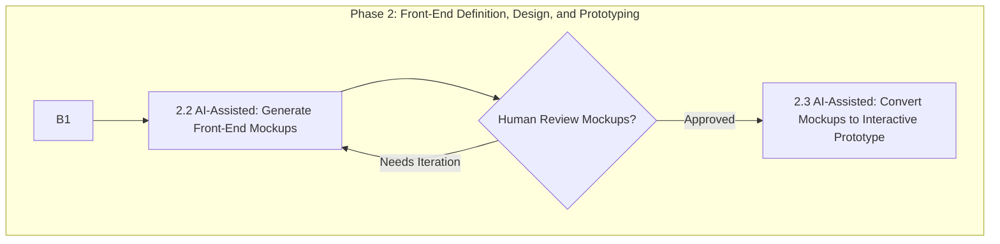

Step 3.1: Analyze Validated Front-End for Data Entities, Attributes, and Relationships
Systematic Analysis Process:

Comprehensive Examination: Review every element and interaction in the approved front-end prototype
Entity Identification: Identify all distinct data entities implied by the UI (e.g., 'User', 'Product', 'Order', 'Comment')
Attribute Mapping: For each entity, list attributes based on:

Form fields in the UI
Displayed data elements
User input requirements
Data shown in tables, lists, cards, etc.

Example Analysis:

User Entity: username, email, password_hash, creation_date (derived from registration forms and user profile displays)
Product Entity: name, description, price, image_url, category (derived from product displays and creation forms)

Relationship Definition:

Determine relationships between entities with specific cardinality
Examples: User can have many Orders (one-to-many), Order contains many Products (many-to-many)
Base relationships on UI interactions and data flow requirements

Step 3.2: Define API Endpoints, Request/Response Payloads based on UI interactions
Interaction-to-API Mapping:

Every UI Interaction: Map each user interaction that requires server communication
Form Submissions: Convert to POST/PUT endpoints with appropriate payloads
Data Loading: Convert to GET endpoints for tables, lists, detail views
Action Buttons: Convert to appropriate HTTP methods (DELETE for remove actions, etc.)

API Design Specifications:

HTTP Method Selection: GET (retrieval), POST (creation), PUT (updates), DELETE (removal)
URL Path Structure: RESTful patterns (/api/users, /api/products/{id})
Request Payload: Data structure and types expected from front-end
Response Payload: Data structure and types returned to front-end

Architectural Adherence:

Ensure RESTful design principles
Follow specified architectural patterns
Maintain consistency across all endpoints

Step 3.3: Outline Backend Modules, Services, and Core Logic Stubs
Modular Structure Design:

Service-Based Architecture: Propose modules like user_service, product_service, order_service
Function Mapping: List core functions/methods required for each API endpoint
Business Logic Identification: Define functions like createUser(userData), getProductById(productId), placeOrder(orderDetails)

Stub Development:

Initial Pseudo-code: Write clear stubs showing function signatures and basic logic flow
Dependency Mapping: Clearly indicate dependencies on data models and other services
API Endpoint Alignment: Ensure each stub corresponds to defined API endpoints

Quality Standards:

Functions must be individually implementable and testable
Clear input/output specifications for each function
Modular design that supports maintainability

AI Agent Guidelines for This Phase:

Source of Truth: Use validated front-end prototype as the primary reference
Systematic Approach: Don't skip any UI elements or interactions in analysis
Validation Checkpoints: Present each specification level for human validation
No Assumptions: If front-end implications are unclear, request clarification
Completeness: Ensure all UI functionality is supported by backend specifications

Critical Validation Points:

Data Model: Must support all UI data requirements
API Specifications: Must handle all UI interactions
Backend Architecture: Must be implementable and maintainable

Output: Complete backend specifications that directly and comprehensively support the validated front-end functionality.