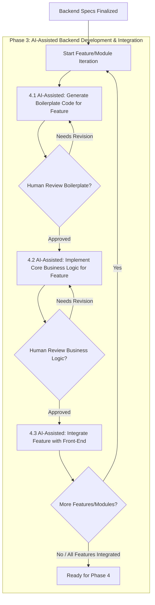

```mermaid
graph TD
    D_Spec["Backend Specs Finalized"] --> D_Loop_Start["Start Feature/Module Iteration"]
    
    subgraph Phase3 ["Phase 3: AI-Assisted Backend Development & Integration"]
        D_Loop_Start --> D1["4.1 AI-Assisted: Generate Boilerplate Code for Feature"]
        D1 --> D1_Val{"Human Review Boilerplate?"}
        D1_Val -->|Needs Revision| D1
        D1_Val -->|Approved| D2["4.2 AI-Assisted: Implement Core Business Logic for Feature"]
        D2 --> D2_Val{"Human Review Business Logic?"}
        D2_Val -->|Needs Revision| D2
        D2_Val -->|Approved| D3["4.3 AI-Assisted: Integrate Feature with Front-End"]
        D3 --> D_Loop_Check{"More Features/Modules?"}
        D_Loop_Check -->|Yes| D_Loop_Start
        D_Loop_Check -->|No / All Features Integrated| E1["Ready for Phase 4"]
    end
```
