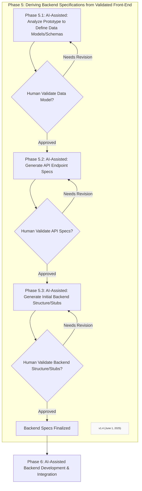

Step 6.1: Generate Backend Boilerplate Code
Comprehensive Boilerplate Generation:

Data Models/Schemas: Generate based on entities and attributes from Step 3.1
Controller/Router Files: Create with empty methods for each API endpoint from Step 3.2
Basic CRUD Operations: Implement Create, Read, Update, Delete operations where applicable
Data Validation: Include validation based on front-end implied constraints

Quality Standards:

Technology Stack Adherence: Ensure compatibility with defined tech stack
Best Practices: Follow coding standards for readability, maintainability, performance
Security Considerations: Implement appropriate security measures (input sanitization, authentication patterns)

Step 6.2: Implement Core Business Logic for each feature
Logic Implementation Process:

Stub Development: Flesh out the core business logic within stubs defined in Step 3.3
Input Processing: Correctly process inputs from front-end via APIs
Output Generation: Produce expected outputs and state changes
Business Rules Application: Implement specific business rules and constraints

Context-Driven Development:

Front-End Context: Pay close attention to business rules implied by front-end design
Requirements Alignment: Ensure logic matches requirements gathered during initial phases
Iterative Approach: Generate code function by function for thorough review

AI Agent Strengths:

Data processing and merging logic implementation
Pattern recognition for common business logic scenarios
Code generation based on well-defined specifications

Step 6.3: Iteratively Connect Front-End Components to Live Backend Endpoints
Integration Process:

Incremental Integration: Connect one backend endpoint at a time
Mock Data Replacement: Update front-end prototype to replace static interactions with live API calls
Thorough Testing: Test each specific integration before proceeding

Iterative Cycle:

Implement a backend piece
Connect front-end to that piece
Test the integration
Repeat for next piece

Testing Requirements:

Individual Endpoint Testing: Verify each API endpoint works correctly
Front-End Integration: Ensure UI correctly displays live data
Error Handling: Test error scenarios and edge cases

AI Agent Guidelines for This Phase:
Core Operational Guidelines:

Decomposition as Default: Break down complex requests into smaller, verifiable steps
Proactive Validation: Ask for human review after each significant step
Code Quality Focus: Adhere to best practices for the specified technology stack
Security Awareness: Highlight security implications and suggest appropriate measures

Security Considerations:

User Password Handling: Implement secure password storage and authentication
Input Sanitization: Prevent injection attacks and data corruption
OAuth Standards: Follow established authentication protocols where applicable
Data Validation: Ensure all inputs are properly validated before processing

Quality Assurance:

Modular Design: Generate code that is modular and maintainable
Documentation: Include appropriate code comments and documentation
Error Handling: Implement robust error handling and logging
Performance: Consider performance implications of generated code

Integration Testing Focus:

End-to-End Flow: Test complete user flows from front-end through backend
Data Consistency: Ensure data flows correctly between UI and database
Error Scenarios: Test how system handles various error conditions
Performance: Monitor response times and system performance

Critical Success Factors:

Incremental Progress: Complete one feature/module before starting the next
Continuous Validation: Get human approval at each validation checkpoint
Quality Over Speed: Ensure each component is robust before integration
Context Awareness: Maintain alignment with validated front-end specifications

Output: Fully integrated application with working front-end connected to functional backend services.
