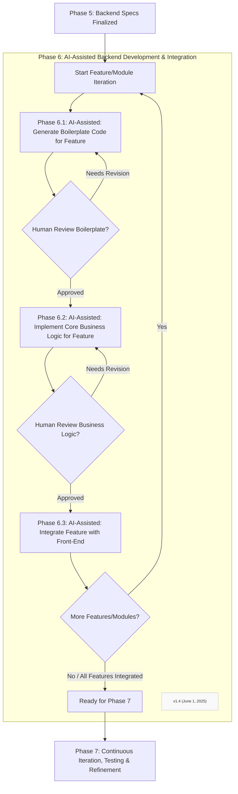

```mermaid
graph TD
    D_Spec["Phase 5: Backend Specs Finalized"] --> D_Loop_Start["Start Feature/Module Iteration"]
    
    subgraph Phase6 ["Phase 6: AI-Assisted Backend Development & Integration"]
        D_Loop_Start --> Phase6_1["Phase 6.1: AI-Assisted: Generate Boilerplate Code for Feature"]
        Phase6_1 --> Phase6_1_Val{"Human Review Boilerplate?"}
        Phase6_1_Val -->|Needs Revision| Phase6_1
        Phase6_1_Val -->|Approved| Phase6_2["Phase 6.2: AI-Assisted: Implement Core Business Logic for Feature"]
        Phase6_2 --> Phase6_2_Val{"Human Review Business Logic?"}
        Phase6_2_Val -->|Needs Revision| Phase6_2
        Phase6_2_Val -->|Approved| Phase6_3["Phase 6.3: AI-Assisted: Integrate Feature with Front-End"]
        Phase6_3 --> D_Loop_Check{"More Features/Modules?"}
        D_Loop_Check -->|Yes| D_Loop_Start
        D_Loop_Check -->|No / All Features Integrated| ReadyForPhase7["Ready for Phase 7"]
        Version["v1.4 (June 1, 2025)"]
        classDef version fill:#f9f9f9,stroke:#ccc,font-size:10px
        class Version version
    end

ReadyForPhase7 --> Phase7["Phase 7: Continuous Iteration, Testing & Refinement"]
```
