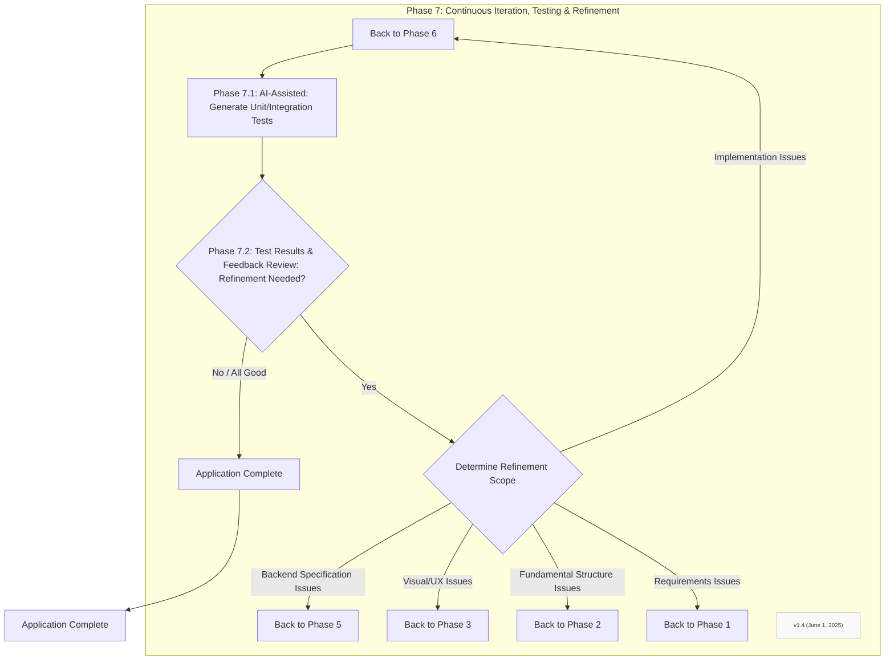

```mermaid
graph TD
    Phase6["Phase 6: AI-Assisted Backend Development & Integration"] --> Phase7_1

    subgraph Phase7 ["Phase 7: Continuous Iteration, Testing & Refinement"]
        Phase7_1["Phase 7.1: AI-Assisted: Generate Unit/Integration Tests"] --> Phase7_2_Val{"Phase 7.2: Test Results & Feedback Review: Refinement Needed?"}
        Phase7_2_Val -->|No / All Good| ApplicationComplete["Application Complete"]
        Phase7_2_Val -->|Yes| RefineDecision{"Determine Refinement Scope"}
        RefineDecision -->|Implementation Issues| Phase6["Back to Phase 6"]
        RefineDecision -->|Backend Specification Issues| Phase5["Back to Phase 5"]
        RefineDecision -->|Visual/UX Issues| Phase3["Back to Phase 3"]
        RefineDecision -->|Fundamental Structure Issues| Phase2["Back to Phase 2"]
        RefineDecision -->|Requirements Issues| Phase1["Back to Phase 1"]
        Version["v1.4 (June 1, 2025)"]
        classDef version fill:#f9f9f9,stroke:#ccc,font-size:10px
        class Version version
    end

ApplicationComplete --> Phase8["Application Complete"]
```
