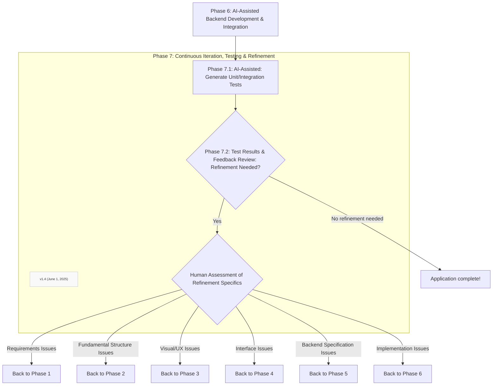

```mermaid
graph TD
    Phase6["Phase 6: AI-Assisted Backend Development & Integration"] --> Phase7_1

    subgraph Phase7 ["Phase 7: Continuous Iteration, Testing & Refinement"]
        Version["v1.4 (June 1, 2025)"]
        classDef version fill:#f9f9f9,stroke:#ccc,font-size:10px
        class Version version
        Phase7_1["Phase 7.1: AI-Assisted: Generate Unit/Integration Tests"] --> Phase7_2{"Phase 7.2: Test Results & Feedback Review: Refinement Needed?"} 
        Phase7_2 --> |Yes|RefineDecision{"Human Assessment of Refinement Specifics"}
        
    end

Phase7_2 -->  |No refinement needed|AllGood["Application complete!"]       
RefineDecision -->|Requirements Issues| Back2Phase1["Back to Phase 1"]
RefineDecision -->|Fundamental Structure Issues| Back2Phase2["Back to Phase 2"]
RefineDecision -->|Visual/UX Issues| Back2Phase3["Back to Phase 3"]
RefineDecision -->|Interface Issues| Back2Phase4["Back to Phase 4"]
RefineDecision -->|Backend Specification Issues| Back2Phase5["Back to Phase 5"]
RefineDecision -->|Implementation Issues| Back2Phase6["Back to Phase 6"]

```
