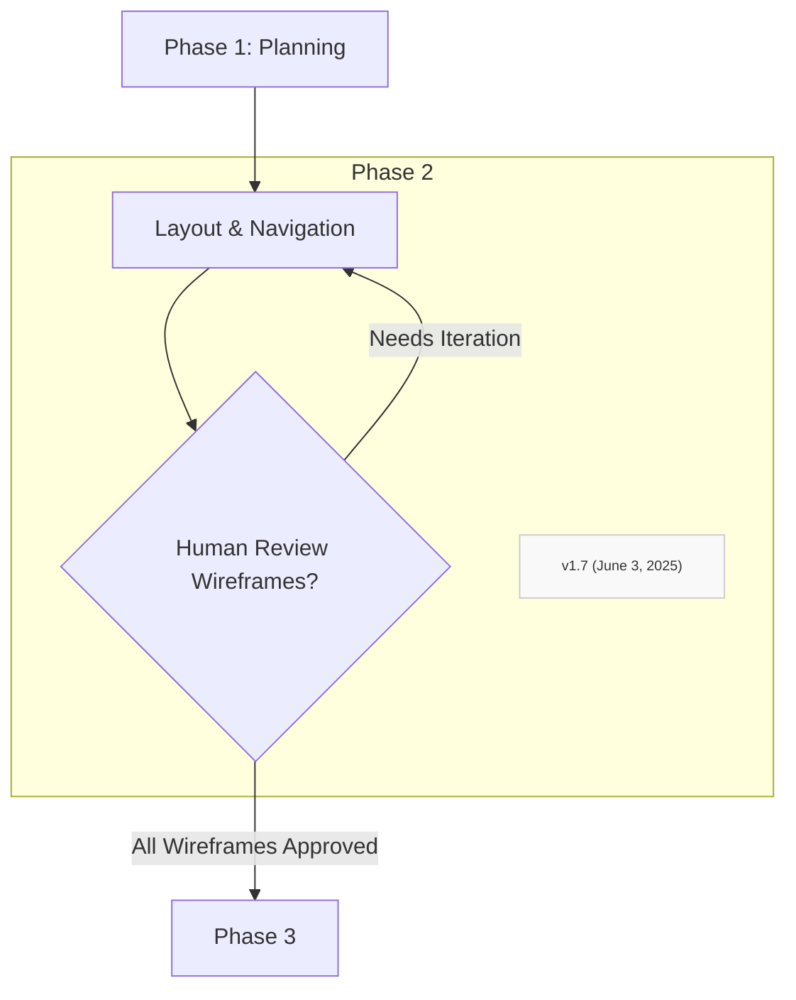

### Step 2.1: Generate Front-End Wireframes (AI-assisted)

#### AI-Assisted Generation Process:
*   Propose layouts and common UI components (buttons, forms, tables, navigation menus)
*   Focus on functionality-appropriate design suggestions
*   Generate initial wireframes based on user flows
*   Present visual suggestions for each identified view/screen

#### Quality Standards:
*   Each wireframe must correspond directly to user flows
*   UI components must be suitable for described functionality
*   Layout must support all identified primary tasks
