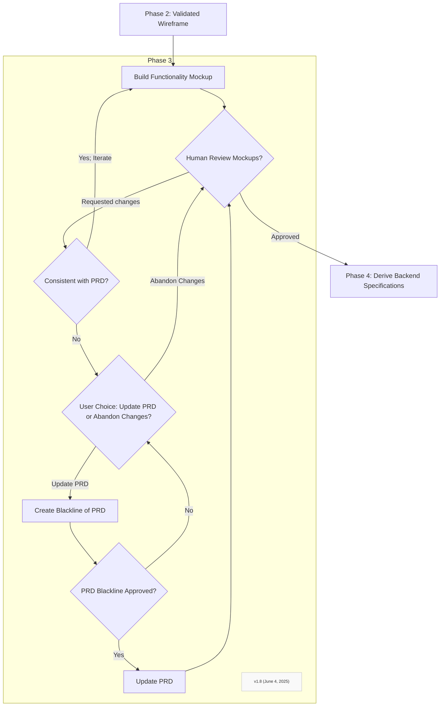

To build a functionality mockup take the validated wireframe and populate it with content in ways that demonstrate the desired functionality and behavior in a light weight way.  This is the clearest example of applying the "Code as Context" tenent of the Front First Method.

### Step 3.1: Build Functionality Mockup (Static HTML/CSS/JS or using UI library components with mock data)
*   Translate the approved wireframe into an interactive mockup. This can be static HTML and CSS, or utilize components from a specified UI library/framework.
*   Focus on accurately representing the UI elements, layout, navigation, and basic interactivity (e.g., button clicks leading to other views, form field interactions). 
*   Use placeholder/mock data to simulate dynamic content, reflecting practices where developers use previously prepared static data for initial UI work.
*   Ensure the prototype adheres to any specified design guidelines in the PRD.
*   Keep the mockup as light as possible. 
*   DO NOT introduce any style or aesthetic changes.
*   DO NOT implement any functionality.
*   Use CSS and Javascript elements only if necessary to illustrate some aspect of desired behavior that cannot be made evident any other way.  Whenever possible it is better to illustrate desired behavior by adjusting the layout, placeholder content, navigation structure, or interactivity. 

### Step 3.2: Stakeholder/User Validation Loop for Front-End Prototype
*   Present the functionality mockup for review by the human user.
*   Prompt for specific feedback on:
    *   Usability
    *   Completeness of behavior illustrated
    *   Correctness of user flows
    *   Overall design
*   Document all requested changes. Iterate until the mockup is fully approved and considered stable. 
*   Compare the requested changes with the PRD, and if any inconsistencies are found between the requested changes and the PRD, explain the changes to the PRD that these requests would imply, and prompt the human user to confirm that they want to change the PRD and proceed with the change.

*   Once approved **This validated mockup will become the primary source of truth.**

### Step 3.3: Update PRD 
*   Compare the behavior and specifications illustrated by the validated mockup with the PRD document, and identify any inconsistencies and gaps.
*   Internally identify changes to the PRD that will be required to make it consistent with the validated mockup. 
*   Review the PRD template, and create a blackline version of the PRD document that has has been updated to make it consistent with the requested changes.  The blackline version of the PRD document must show text proposed for removal using the strikethrough font style, and any new text added must be shown with underlining using <u></u> html tags.  
*   Presenting the user with a blackline version of the PRD document and seek approval.  
*   If user request further changes, the repeat the loop by returning to the start of this step, comparing the requested changes with the PRD Document and creating an updated blackline version that identifies all additions and deletions to the PRD that have not yet been approved by the user.
*   If the user approves some of the proposed changes, then update the PRD document with those changes, and stop blacklining the approved changes.
*   If the user approves all of the proposed changes, then update the PRD document to incorporate all approved changes, stop blacklining all proposed changes, and once the PRD document has been updated, delete the blackline version of the PRD document.
