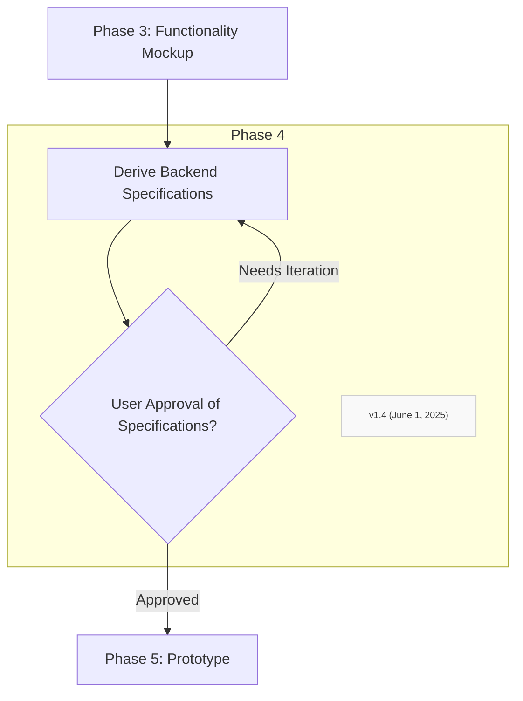

### Step 4.1: Develop Interactive Front-End Prototypes (Static HTML/CSS/JS or using UI library components with mock data)
*   Translate the approved wireframes/mockups into interactive front-end prototypes. This can be static HTML, CSS, and JavaScript, or utilize components from a specified UI library/framework.
*   Focus on accurately representing the UI elements, layout, navigation, and basic interactivity (e.g., button clicks leading to other views, form field interactions). Use placeholder/mock data to simulate dynamic content, reflecting practices where developers use previously prepared static data for initial UI work.
*   Ensure the prototype is responsive and adheres to any specified design guidelines.

### Step 4.2: Stakeholder/User Validation Loop for Front-End Prototype
*   Present the complete interactive front-end prototype for thorough review by the human user/stakeholders.
*   Prompt for specific feedback on:
    *   Usability
    *   Completeness of features
    *   Correctness of user flows
    *   Overall design
*   Document all requested changes. Iterate on Step 1.3 and this step until the front-end prototype is fully approved and considered stable. **This validated prototype is now the primary specification.**
