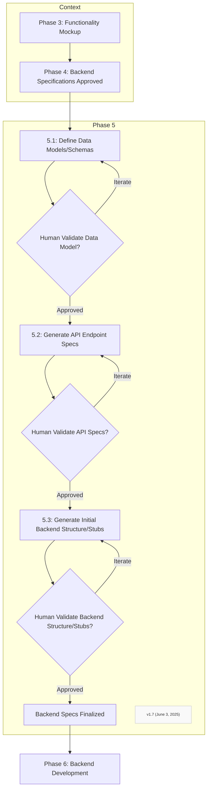

```mermaid
graph TD

    subgraph Context["Context"]
        Phase3["Phase 3: Functionality Mockup"] --> Phase4["Phase 4: Backend Specifications Approved"]
        
    end

    subgraph Phase5["Phase 5"]
        Phase4["Phase 4: Backend Specifications Approved"] --> Phase5_1        
        Phase5_1["5.1: Define Data Models/Schemas"]    
        Phase5_1 --> Phase5_1_Val{"Human Validate Data Model?"}
        Phase5_1_Val -->|Iterate| Phase5_1
        Phase5_1_Val -->|Approved| Phase5_2["5.2: Generate API Endpoint Specs"]
        Phase5_2 --> Phase5_2_Val{"Human Validate API Specs?"}
        Phase5_2_Val -->|Iterate| Phase5_2
        Phase5_2_Val -->|Approved| Phase5_3["5.3: Generate Initial Backend Structure/Stubs"]
        Phase5_3 --> Phase5_3_Val{"Human Validate Backend Structure/Stubs?"}
        Phase5_3_Val -->|Iterate| Phase5_3
        Phase5_3_Val -->|Approved| BackendSpecsFinalized["Backend Specs Finalized"]
        Version["v1.7 (June 3, 2025)"]
        classDef version fill:#f9f9f9,stroke:#ccc,font-size:10px
        class Version version
    end
 


BackendSpecsFinalized --> Phase6["Phase 6: Backend Development"]
```

