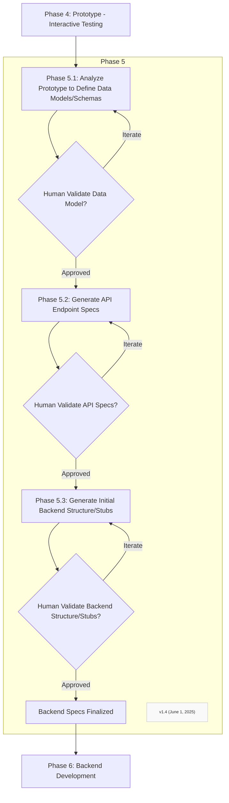

### Step 5.1: Analyze Validated Front-End for Data Entities, Attributes, and Relationships
*   Systematically examine every element and interaction in the approved front-end prototype.
*   Identify all distinct data entities implied by the UI (e.g., 'User', 'Product', 'Order', 'Comment').
*   For each entity, list its attributes (e.g., for 'User': username, email, password_hash, creation_date) based on form fields, displayed data, etc.
*   Determine relationships between entities (e.g., a 'User' can have many 'Orders'; an 'Order' contains many 'Products'). Specify cardinality (one-to-one, one-to-many, many-to-many).
*   Present this proposed data model (entities, attributes, relationships) for human validation.

### Step 5.2: Define API Endpoints, Request/Response Payloads based on UI interactions
*   For each user interaction in the front-end that requires data from or sends data to a server (e.g., form submissions, data loading for a table, button clicks triggering actions), define a corresponding API endpoint.
*   Specify:
    *   **HTTP method** (GET, POST, PUT, DELETE)
    *   **URL path**
    *   **Expected request payload** (data structure and types)
    *   **Expected response payload** (data structure and types)
    This aligns with AI's capability to assist in generating API requests and hooks.
*   Ensure API design is RESTful or follows specified architectural patterns.
*   Present the complete list of API endpoints and their specifications for human validation.

### Step 5.3: Outline Backend Modules, Services, and Core Logic Stubs
*   Based on the data model and API endpoints, propose a modular structure for the backend (e.g., user_service, product_service, order_service).
*   For each module/service, list the core functions/methods required to handle the defined API endpoints and business logic (e.g., createUser(userData), getProductById(productId), placeOrder(orderDetails)).
*   Write initial stubs or pseudo-code for this core logic, clearly indicating dependencies on data models and other services.
*   Present this backend structural outline and logic stubs for human validation.
