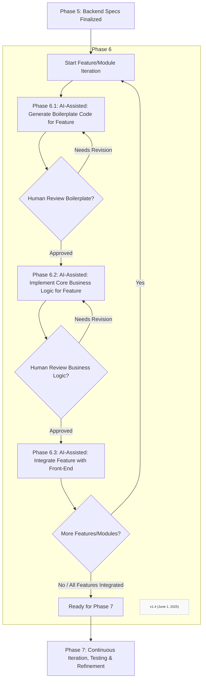

### Phase 6.1: Generate Backend Boilerplate Code (e.g., controllers, models, basic CRUD)
*   For an approved module/feature: Generate the boilerplate code for data models/schemas based on Step 5.1.
*   Generate controller/router files with empty methods for the API endpoints defined in Step 5.2.
*   Implement basic CRUD (Create, Read, Update, Delete) operations for entities where applicable, ensuring data validation based on front-end implied constraints.
*   Present generated code for review.

### Phase 6.2: Implement Core Business Logic for each feature, guided by front-end context
*   Flesh out the core business logic within the stubs defined in Step 5.3, ensuring it correctly processes inputs from the front-end (via APIs) and produces the expected outputs/state changes.
*   Pay close attention to any specific business rules or constraints discussed during requirements gathering or implied by the front-end design. AI has shown effectiveness in handling data processing and merging logic.
*   Generate this code iteratively, perhaps function by function, for human review and validation.

### Phase 6.3: Iteratively Connect Front-End Components to Live Backend Endpoints
*   Once a backend API endpoint is implemented and validated, guide the human developer (or assist if capable) in updating the front-end prototype to replace mock data/static interactions with live calls to this endpoint.
*   Test this specific integration thoroughly. This is an iterative process: implement a backend piece, connect front-end, test, repeat.
