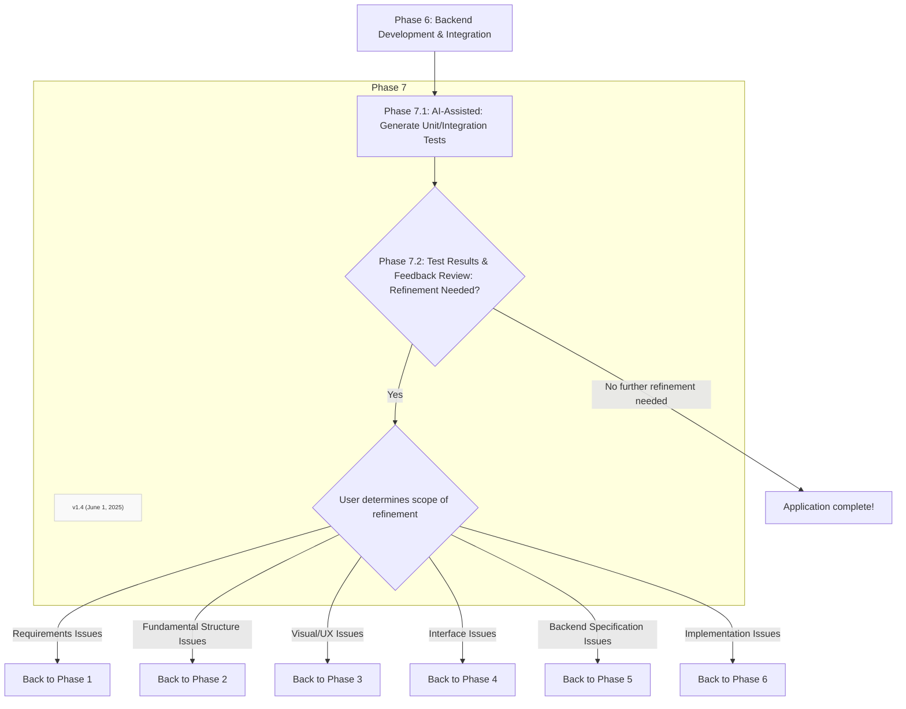

# Phase 7:  Continuous Iteration, Testing & Refinement

### Phase 7.1: Implement Comprehensive Testing (Unit, Integration, End-to-End for UI-Backend flow)
*   For all AI-generated backend code, assist in generating unit tests that cover individual functions and logic.
*   Define and help set up integration tests to verify interactions between different backend modules/services.
*   Outline end-to-end test scenarios that trace complete user flows from the (now connected) front-end through the backend and back to the UI. AI can be instrumental in devising test scripts.

### Phase 7.2: Refine based on test results and further feedback
*   Analyze test results. If failures occur, assist in debugging by identifying potential error sources in the AI-generated code, leveraging AI's strengths in error analysis and explanation.
*   Incorporate any further user/stakeholder feedback that arises from testing the integrated application.
*   Repeat development and testing steps as needed until the feature/application meets all requirements.
