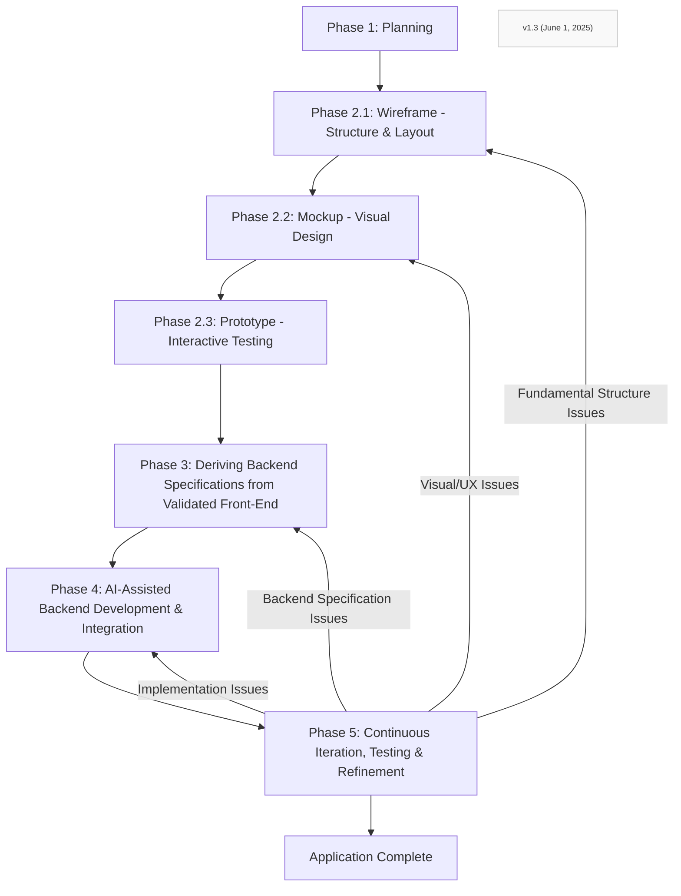

```mermaid
graph TD
    A["Phase 1: Planning"] --> Phase2_1["Phase 2.1: Wireframe - Structure & Layout"]
    Phase2_1 --> Phase2_2["Phase 2.2: Mockup - Visual Design"]
    Phase2_2 --> Phase2_3["Phase 2.3: Prototype - Interactive Testing"]
    Phase2_3 --> Phase3["Phase 3: Deriving Backend Specifications from Validated Front-End"]
    Phase3 --> Phase4["Phase 4: AI-Assisted Backend Development & Integration"]
    Phase4 --> Phase5["Phase 5: Continuous Iteration, Testing & Refinement"]
    Phase5 --> F["Application Complete"]
    
    Phase5 -->|Implementation Issues| Phase4
    Phase5 -->|Backend Specification Issues| Phase3
    Phase5 -->|Visual/UX Issues| Phase2_2
    Phase5 -->|Fundamental Structure Issues| Phase2_1
    
    Version["v1.3 (June 1, 2025)"]
    
    classDef version fill:#f9f9f9,stroke:#ccc,font-size:10px
    class Version version
```
