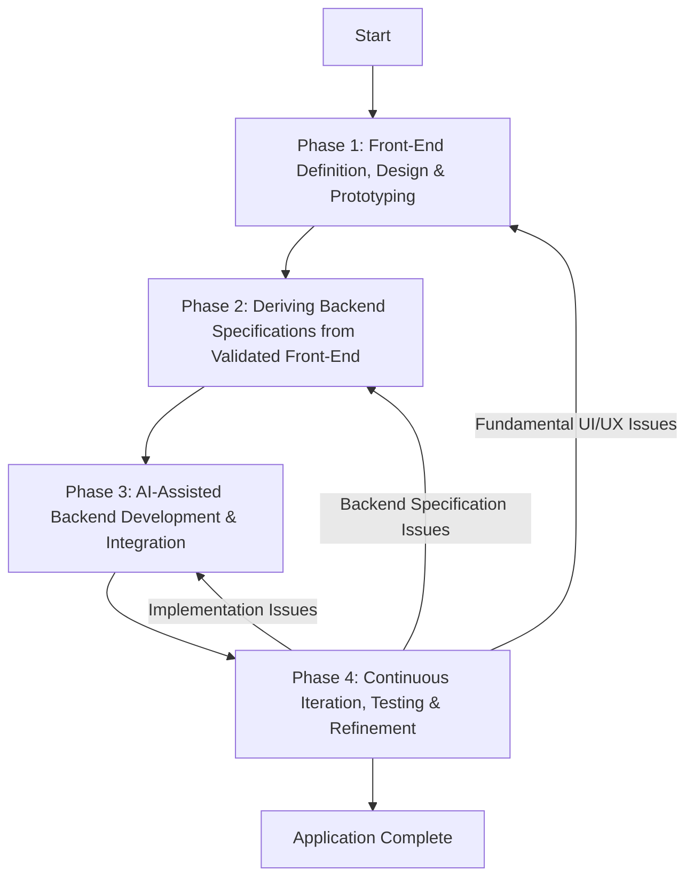

```mermaid
graph TD
    A[Start] --> Phase1["Phase 1: Front-End Definition, Design & Prototyping"]
    Phase1 --> Phase2["Phase 2: Deriving Backend Specifications from Validated Front-End"]
    Phase2 --> Phase3["Phase 3: AI-Assisted Backend Development & Integration"]
    Phase3 --> Phase4["Phase 4: Continuous Iteration, Testing & Refinement"]
    Phase4 --> F["Application Complete"]
    
    Phase4 -->|Implementation Issues| Phase3
    Phase4 -->|Backend Specification Issues| Phase2
    Phase4 -->|Fundamental UI/UX Issues| Phase1
```
