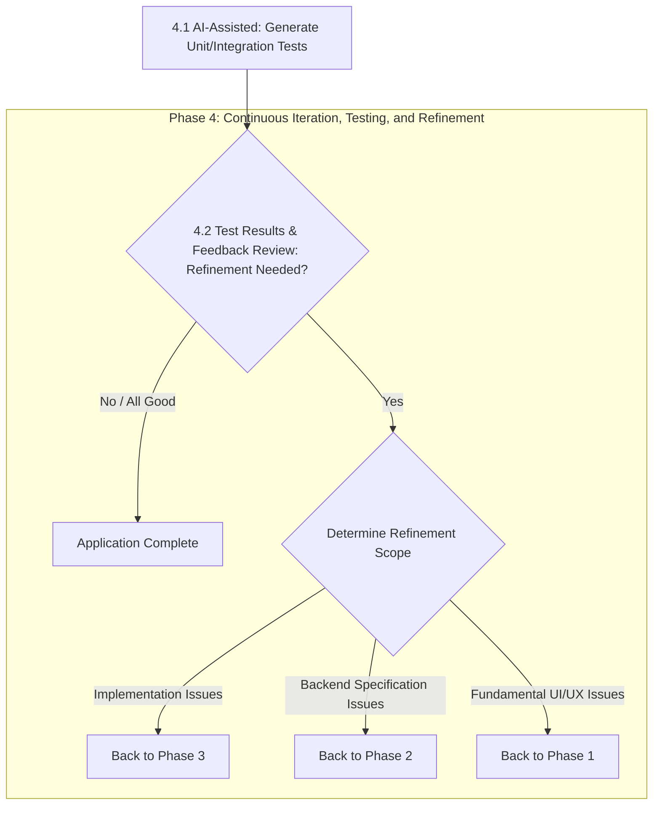

```mermaid
graph TD
    E1["4.1 AI-Assisted: Generate Unit/Integration Tests"] --> E2_Val{"4.2 Test Results & Feedback Review: Refinement Needed?"}
    
    subgraph Phase4 ["Phase 4: Continuous Iteration, Testing, and Refinement"]
        E2_Val -->|No / All Good| F["Application Complete"]
        E2_Val -->|Yes| E_Refine_Decision{"Determine Refinement Scope"}
        E_Refine_Decision -->|Implementation Issues| D_Loop_Start["Back to Phase 3"]
        E_Refine_Decision -->|Backend Specification Issues| C1["Back to Phase 2"]
        E_Refine_Decision -->|Fundamental UI/UX Issues| B1["Back to Phase 1"]
    end
```
