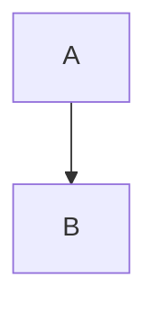
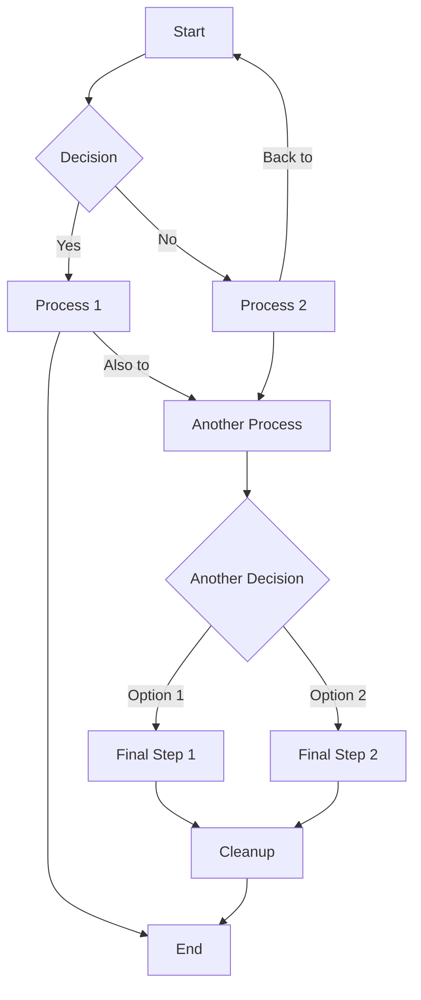
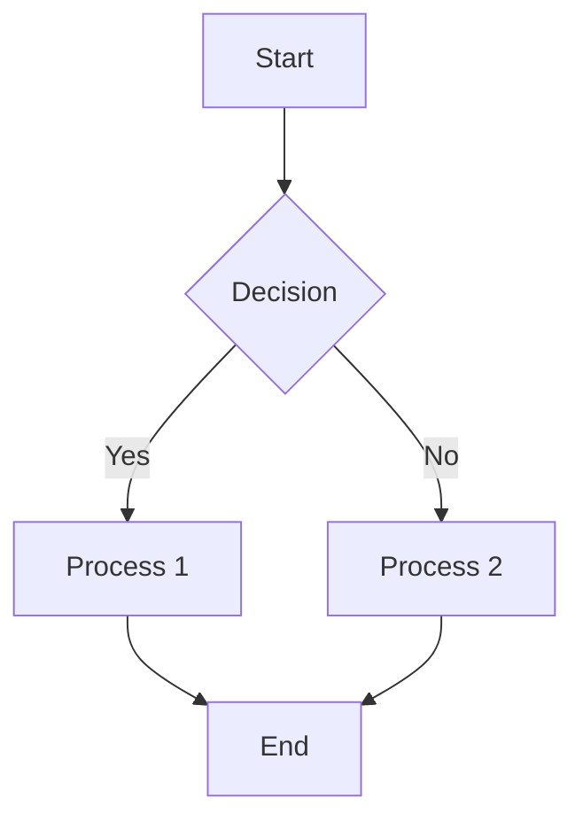
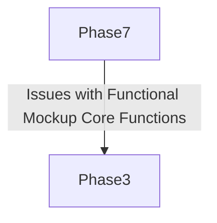

This file serves as a reference for common Mermaid syntax issues and best practices when working with Large Language Models (LLMs).

# Best Practices

1. **Edge labels with spaces and special characters:**  Use -->|Approved| instead for cleaner edge labels.
2. **Subgraph naming:** Subgraph IDs with spaces need to be handled properly. Use subgraph Phase1 ["Phase 1: Display Name"] format.
3. **Short descriptions:** Very long text in nodes can cause rendering issues. Shorten longer longer descriptions while keeping the meaning clear.
4. **Parentheses vs brackets:** Mixed usage can sometimes cause issues. Standardized to use square brackets [] for process nodes and curly braces {} for decision nodes.
5. **Quote handling:** Text with special characters, colons, or long phrases should be wrapped in quotes to prevent parsing errors.
6. **Keep it concise:** Aim for clarity and simplicity in your diagrams. Avoid overly complex structures that can be difficult to read and maintain.
7. **Maintain consistent indentation:** While not always strictly enforced by Mermaid, consistent indentation improves the readability of your diagram code.
8. **Avoid trailing spaces:** Be mindful of trailing spaces, especially in class definitions, as they can lead to unexpected parsing errors.
9. **Validate frequently:** Validate your Mermaid code often by asking user to report on whether the mermaid diagram is rendering properly, especially after making significant changes, to catch syntax errors early.
10. **Use the Troubleshooting Checklist:**  When errors are encountered, start by systematically running through the Troubleshooting Checklist.  Never try to debug mermaid diagrams without first running through the Troubleshooting Checklist (see below).


# Toubleshooting Checklist
Format for Checklist items...

```
### [Number]. [issue name]
**Check for:**  [describe how to check for this issue]
**Typical Error Message:**  [example error message]  {optional}
#### Example of Incorrect Syntax
[code snippet]
#### Example of Correct Syntax
[code snippet]
```


### 1. Trailing spaces
**Check for:** Trailing spaces on `class [node_id] [class_name]` lines, especially when immediately followed by `end` in a subgraph.

**Typical Error Message:** `Unable to render rich display ... Expecting 'SEMI', 'NEWLINE', 'EOF', 'AMP', 'COLON', 'DOWN', 'DEFAULT', 'NUM', 'COMMA', 'NODE_STRING', 'BRKT', 'MINUS', 'MULT', 'UNICODE_TEXT', got 'SPACE'`
#### Example of Incorrect Syntax
```
graph TD
    subgraph Example
        class Version version
    end
```

### 2. Missing mermaid Language Identifier
**Check for:**   LLMs might forget to include `mermaid` after the opening triple backticks. Without `mermaid`, the parser will not interpret the block as a diagram.
#### Example of Incorrect Syntax
```
graph TD
    A --> B
```
#### Example of Correct Syntax

* (Note:  The backticks in the above examples are not visible if viewing this file in markdown formatted mode.  View in text mode to see the backticks.)


### 3. Missing quotes for node labels with spaces
**Check for:**   Common oversight; LLMs treat labels as simple strings. Node labels or link text containing spaces or special characters must typically be enclosed in double quotes (").
#### Example of Incorrect Syntax
```
graph TD; Node With Space --> B;
```
#### Example of Correct Syntax
```
graph TD;
nodeA --> B;
```

### 4. Using keyword end as unquoted node text in flowchart
**Check for:**   `end` is a structural keyword; LLM doesn't differentiate its use as text.
#### Example of Incorrect Syntax
```
graph TD; subgraph Test
 A[Activity]
 B[end]
end
```
#### Example of Correct Syntax
```
graph TD;
subgraph Test
 A[Activity]
 B["end"]
end
```

### 5. Incorrect inheritance arrow in Class Diagram
**Check for:**   LLMs often use generic arrows instead of specific UML symbols. Inheritance should use `<|--`.
#### Example of Incorrect Syntax
```
classDiagram
Animal --> Mammal
```
#### Example of Correct Syntax
```
classDiagram
Animal <|-- Mammal
```

### 6. Incorrect indentation for hierarchy in Mindmap
**Check for:**   LLMs struggle with precise spatial formatting. Mindmap hierarchy is defined by indentation levels.
#### Example of Incorrect Syntax
```
mindmap
Root
 Child1
 Grandchild (Inconsistent spaces)
```
#### Example of Correct Syntax
```
mindmap
 Root
 Child1
 Grandchild (Consistent 2 or 4 spaces)
```

### 7. Incorrect message arrow type in Sequence Diagram
**Check for:**   Many arrow types; LLM picks a common one or an incorrect one. For synchronous calls, `->>` is often needed.
#### Example of Incorrect Syntax
```
sequenceDiagram
Alice->Bob: Message (Missing arrowhead for sync call)
```
#### Example of Correct Syntax
```
sequenceDiagram
Alice->>Bob: Message
```

### 8. Incorrect cardinality syntax in ERD
**Check for:**   Complex, specific symbols for ERD relationships are hard for LLMs. LLMs often invent symbols or use flowchart arrows.
#### Example of Incorrect Syntax
```
erDiagram
CUSTOMER--o< ORDER : places (Invented cardinality)
```
#### Example of Correct Syntax
```
erDiagram
CUSTOMER--o{ ORDER : places (Correct one-to-many)
```

### 9. Incorrect classDef syntax
**Check for:**   Styling syntax is detailed and less common in general text. Common mistakes include missing semicolons, using incorrect property names, or invalid values.
#### Example of Incorrect Syntax
```
classDef highlight fill:#ffff00 stroke:#000 (Missing semicolon)
```
#### Example of Correct Syntax
```
classDef highlight fill:#ffff00,stroke:#000,stroke-width:2px;
```

### 10. Overly complex or mangled structures
**Check for:**   LLM may generate elements without a clear global plan for the diagram's layout or logic, leading to messy, hard-to-follow diagrams.
#### Example of Incorrect Syntax

#### Example of Correct Syntax


### 11. Parentheses in Edge Labels
**Check for:** Parentheses `()` in edge labels. Mermaid does not support parentheses in edge labels.

**Typical Error Message:** `Expecting 'SQE', 'DOUBLECIRCLEEND', 'PE', '-)', 'STADIUMEND', 'SUBROUTINEEND', 'PIPE', 'CYLINDEREND', 'DIAMOND_STOP', 'TAGEND', 'TRAPEND', 'INVTRAPEND', 'UNICODE_TEXT', 'TEXT', 'TAGSTART', got 'PS'.`
#### Example of Incorrect Syntax
```mermaid
graph TD
    Phase7 -->|Issues with Functional Mockup (Core Functions)| Phase3
```
#### Example of Correct Syntax


### 12. Version incompatibility (e.g., C4 diagrams)
**Check for:**   LLM knowledge is static; unaware of library updates unless specifically trained/prompted. Syntax might be correct for the latest Mermaid.js, but an older version of the Mermaid library bundled in a plugin or tool could cause errors.
#### Example of Incorrect Syntax
```
C4Context
    Person(user, "User")
    System(system, "Software System")
    Rel(user, system, "Uses")
```
#### Example of Correct Syntax
```
graph TD
    A[User] --> B[Software System]
```
#### Example of Correct Syntax
```
graph TD
    subgraph Example
        class Version version
    end
